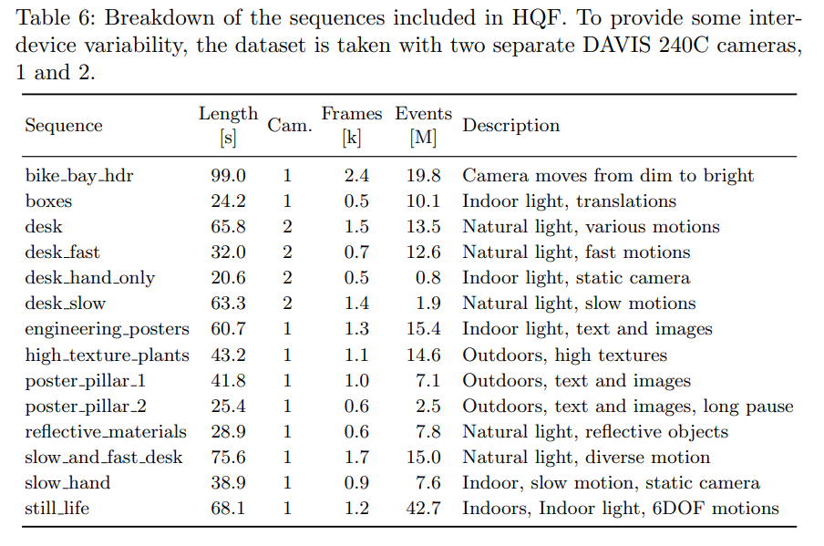

# High-Quality-Frames-dataset-HQF-
Parsing-free High Quality Frames dataset (HQF) in the PNG and NPY format.
 
## description
"We present a new High Quality Frames dataset (HQF) aimed at providing ground truth DAVIS frames that are minimally motion-blurred and well exposed. In addition, our HQF covers a wider range of motions and scene types than the evaluation dataset used for E2VID, including: static/dynamic camera motion vs. dynamic camera only, very slow to fast vs. medium to fast and indoor/outdoor vs. indoor only. To record HQF, we used two different DAVIS240C sensors to capture data with different noise/CT characteristics. We used default bias settings loaded
by the RPG DVS ROS driver5, and set exposure to either auto or fixed to maximize frame quality. Our HQF provides temporally synchronized, registered events and DAVIS frames (further details in supplementaries, Table 6)."

## Link of raw dataset in the BAG format 
### Reducing the Sim-to-Real Gap for Event Cameras
[[project page](https://timostoff.github.io/20ecnn)] [[paper](https://arxiv.org/pdf/2003.09078.pdf)] [[raw dataset](https://drive.google.com/drive/folders/18Xdr6pxJX0ZXTrXW9tK0hC3ZpmKDIt6_)]

## Parsing-free High Quality Frames dataset (HQF) in the PNG and NPY format.
[[Link](https://drive.google.com/file/d/1E-96xHY1ihcZqzVpm5DEc_bGwhN8n_uc/view?usp=sharing)]

